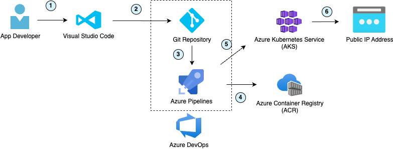

# Terraform Azurerm Kubernetes Cluster

The main purpose of this repository is to create Azure resources needed to deploy a FastAPI service to Azure Kubernetes service. The code for the FastAPI service can be found [here](https://dev.azure.com/k-space/k/_git/python-fastapi-azure-k8s-cluster) [^1],
the repository also contains Azure Pipelines to pull and push a docker image to the Azure Container Registry, and re-use use this image to deploy to the Kubernetes cluster.

The main resources created via this Terraform are:
- Azure Active Directory Applications (App registration and Enterprise application)
- Azure Kubernetes Service
- Azure Container Registry
- Azure DevOps service connections

> [!NOTE]
>
> This repository was created within Azure DevOps and is now being mirrored to this GitHub [repository](https://github.com/kwame-mintah/terraform-azurerm-kubernetes-cluster).
> Source of truth will always be the Azure DevOps [repository](https://dev.azure.com/k-space/k/_git/k-infrastructure-terraform).

## Architecture



1. Developer makes changes to the source code then pushes changes.
2. Azure pipeline triggered by new commit and starts a build on either Microsoft hosted agent or self-managed build agents.
3. Azure build agent starts and runs unit tests within the repository.
4. Azure pipeline creates a docker image, tags and pushed to an Azure container registry.
5. Azure pipeline pulls the recently pushed image and deploys to Azure Kubernetes Cluster.
6. Application is accessible from public URLs.

## Development

### Dependencies

- [terraform](https://www.terraform.io/)
- [terragrunt](https://terragrunt.gruntwork.io/)
- [pre-commit](https://pre-commit.com/)
- [terraform-docs](https://terraform-docs.io/) this is required for `terraform_docs` hooks

## Prerequisites

1. Have a [Azure Portal](https://portal.azure.com/) account. 
2. You will need to create a Service Principal with a Client Secret [follow instructions](https://registry.terraform.io/providers/hashicorp/azurerm/latest/docs/guides/service_principal_client_secret#creating-a-service-principal-in-the-azure-portal).

## Usage

1. Navigate to the environment you would like to deploy,
2. Plan your changes with `terragrunt plan` to see what changes will be made,
3. If you're happy with the changes `terragrunt apply`.

> [!IMPORTANT]
> 
>Please note that `.tfstate` files are stored locally on your machine as no backend has been specified. If you would like to properly version control your state files, please configure an azure storage account to store these files. 
> This will ensure anyone else other than you running a plan or apply will be using the same state file.

## Cost

A majority of the resources created will have either be 'Standard' or 'Premium' tier. Please be mindful of the cost for each tier, [Infracost](https://www.infracost.io/) has been used to help indicate how much it will cost to
have all these resources created and running for a month.

details>
<summary>Predicted Infracost as of 12/12/2023</summary>

  ```markdown
   Name                                                                     Monthly Qty  Unit                  Monthly Cost

  module.kubernetes_cluster.azurerm_kubernetes_cluster.cluster
  ├─ Uptime SLA                                                                    730  hours                       $73.00
  ├─ default_node_pool
  │  ├─ Instance usage (Linux, pay as you go, Standard_D2_v2)                    1,460  hours                      $198.56
  │  └─ os_disk
  │     └─ Storage (S10, LRS)                                                        2  months                      $11.78
  └─ Load Balancer
      └─ Data processed                                                Monthly cost depends on usage: $0.005 per GB

  module.python_fastapi_registry.azurerm_container_registry.registry
  ├─ Geo replication (1 location)                                                   30  days                        $50.00
  ├─ Registry usage (Premium)                                                       30  days                        $50.00
  ├─ Storage (over 500GB)                                             Monthly cost depends on usage: $0.10 per GB
  └─ Build vCPU                                                       Monthly cost depends on usage: $0.0001 per seconds

  OVERALL TOTAL                                                                                                    $383.33
  ──────────────────────────────────
  13 cloud resources were detected:
  ∙ 2 were estimated, all of which include usage-based costs, see https://infracost.io/usage-file
  ∙ 10 were free:
    ∙ 7 x azurerm_role_assignment
    ∙ 1 x azurerm_container_registry_scope_map
    ∙ 1 x azurerm_container_registry_token
    ∙ 1 x azurerm_resource_group
    ∙ 1 is not supported yet, see https://infracost.io/requested-resources:
    ∙ 1 x azurerm_container_registry_token_password
  ```

</details>

## Pre-Commit hooks

Git hook scripts are very helpful for identifying simple issues before pushing any changes. Hooks will run on every commit automatically pointing out issues in the code e.g. trailing whitespace.

To help with the maintenance of these hooks, [pre-commit](https://pre-commit.com/) is used, along with [pre-commit-hooks](https://pre-commit.com/#install).

Please follow [these instructions](https://pre-commit.com/#install) to install `pre-commit` locally and ensure that you have run `pre-commit install` to install the hooks for this project.

Additionally, once installed, the hooks can be updated to the latest available version with `pre-commit autoupdate`.

## Documentation Generation

Code formatting and documentation for `variables` and `outputs` is generated using [pre-commit-terraform](https://github.com/antonbabenko/pre-commit-terraform/releases) hooks that in turn uses [terraform-docs](https://github.com/terraform-docs/terraform-docs) that will insert/update documentation. The following markers have been added to the `README.md`:
```
<!-- {BEGINNING|END} OF PRE-COMMIT-TERRAFORM DOCS HOOK --->
```

<!-- BEGINNING OF PRE-COMMIT-TERRAFORM DOCS HOOK --->
## Requirements

| Name | Version |
|------|---------|
| <a name="requirement_terraform"></a> [terraform](#requirement\_terraform) | = 1.4.5 |
| <a name="requirement_azuread"></a> [azuread](#requirement\_azuread) | 2.46.0 |
| <a name="requirement_azuredevops"></a> [azuredevops](#requirement\_azuredevops) | = 0.8.0 |
| <a name="requirement_azurerm"></a> [azurerm](#requirement\_azurerm) | 3.82.0 |
| <a name="requirement_time"></a> [time](#requirement\_time) | 0.10.0 |

## Providers

| Name | Version |
|------|---------|
| <a name="provider_azuread"></a> [azuread](#provider\_azuread) | 2.46.0 |
| <a name="provider_azuredevops"></a> [azuredevops](#provider\_azuredevops) | 0.8.0 |
| <a name="provider_azurerm"></a> [azurerm](#provider\_azurerm) | 3.82.0 |
| <a name="provider_time"></a> [time](#provider\_time) | 0.10.0 |

## Modules

| Name | Source | Version |
|------|--------|---------|
| <a name="module_azure_devops_service_connections"></a> [azure\_devops\_service\_connections](#module\_azure\_devops\_service\_connections) | ./modules/service_connections | n/a |
| <a name="module_kubernetes_cluster"></a> [kubernetes\_cluster](#module\_kubernetes\_cluster) | ./modules/kubernetes_service | n/a |
| <a name="module_python_fastapi_registry"></a> [python\_fastapi\_registry](#module\_python\_fastapi\_registry) | ./modules/container_registry | n/a |

## Resources

| Name | Type |
|------|------|
| [azuread_application.aad_application](https://registry.terraform.io/providers/hashicorp/azuread/2.46.0/docs/resources/application) | resource |
| [azuread_application_password.aad_application_password](https://registry.terraform.io/providers/hashicorp/azuread/2.46.0/docs/resources/application_password) | resource |
| [azuread_service_principal.service_principal_application_id](https://registry.terraform.io/providers/hashicorp/azuread/2.46.0/docs/resources/service_principal) | resource |
| [azurerm_resource_group.resource_group](https://registry.terraform.io/providers/hashicorp/azurerm/3.82.0/docs/resources/resource_group) | resource |
| [time_rotating.aad_application_password_rotation](https://registry.terraform.io/providers/hashicorp/time/0.10.0/docs/resources/rotating) | resource |
| [azuread_client_config.current](https://registry.terraform.io/providers/hashicorp/azuread/2.46.0/docs/data-sources/client_config) | data source |
| [azuredevops_project.project](https://registry.terraform.io/providers/microsoft/azuredevops/0.8.0/docs/data-sources/project) | data source |

## Inputs

| Name | Description | Type | Default | Required |
|------|-------------|------|---------|:--------:|
| <a name="input_arm_client_id"></a> [arm\_client\_id](#input\_arm\_client\_id) | The Client ID which should be used. This can also be sourced <br>from the ARM\_CLIENT\_ID Environment Variable. | `string` | n/a | yes |
| <a name="input_arm_client_secret"></a> [arm\_client\_secret](#input\_arm\_client\_secret) | The Client Secret which should be used. This can also be sourced <br>from the ARM\_CLIENT\_SECRET Environment Variable. | `string` | n/a | yes |
| <a name="input_arm_subscription_id"></a> [arm\_subscription\_id](#input\_arm\_subscription\_id) | The Subscription ID which should be used. This can also be sourced <br>from the ARM\_SUBSCRIPTION\_ID Environment Variable. | `string` | n/a | yes |
| <a name="input_arm_tenant_id"></a> [arm\_tenant\_id](#input\_arm\_tenant\_id) | The Tenant ID which should be used. This can also be sourced <br>from the ARM\_TENANT\_ID Environment Variable. | `string` | n/a | yes |
| <a name="input_cloud_enviornment"></a> [cloud\_enviornment](#input\_cloud\_enviornment) | The Cloud Environment which should be used. Possible values are public,<br>`usgovernment`, `german`, and `china`. Defaults to `public`. This can also be <br>sourced from the ARM\_ENVIRONMENT Environment Variable. | `string` | `"public"` | no |
| <a name="input_environment"></a> [environment](#input\_environment) | The name of the _environment_ to help identify resources. | `string` | n/a | yes |
| <a name="input_location"></a> [location](#input\_location) | The Azure Region where the Resource Group should exist. <br>Changing this forces a new Resource Group to be created. | `string` | `"West Europe"` | no |
| <a name="input_organization_url"></a> [organization\_url](#input\_organization\_url) | This is the Azure DevOps organization url. <br>It can also be sourced from the AZDO\_ORG\_SERVICE\_URL environment variable. | `string` | n/a | yes |
| <a name="input_personal_access_token"></a> [personal\_access\_token](#input\_personal\_access\_token) | This is the Azure DevOps organization personal access token. <br>The account corresponding to the token will need "owner" privileges for this organization. <br>It can also be sourced from the AZDO\_PERSONAL\_ACCESS\_TOKEN environment variable. | `string` | n/a | yes |
| <a name="input_personal_ip_address"></a> [personal\_ip\_address](#input\_personal\_ip\_address) | Add your client IP address to the networking to allow access. | `string` | n/a | yes |
| <a name="input_project_name"></a> [project\_name](#input\_project\_name) | Name of the project. | `string` | n/a | yes |
| <a name="input_tags"></a> [tags](#input\_tags) | Tags to be added to resources created. | `map(string)` | `{}` | no |

## Outputs

| Name | Description |
|------|-------------|
| <a name="output_azurerm_service_connection_id"></a> [azurerm\_service\_connection\_id](#output\_azurerm\_service\_connection\_id) | The ID of the azure resource manager service endpoint. |
| <a name="output_docker_registry_service_connection_id"></a> [docker\_registry\_service\_connection\_id](#output\_docker\_registry\_service\_connection\_id) | The ID of the docker registry service endpoint. |
| <a name="output_tenant_id"></a> [tenant\_id](#output\_tenant\_id) | The tenant ID used for this subscription. |
<!-- END OF PRE-COMMIT-TERRAFORM DOCS HOOK --->

[^1]: My Azure DevOps organisation / project is private, FastAPI repository is mirrored [here](https://github.com/kwame-mintah/python-fastapi-azure-k8s-cluster) in GitHub.